# tgbot-ds
Telegram bot for Synology Download Station

재택근무를 하면서 q10에서 타오나스를 구매했습니다. 
주 용도는 마크 서버 및 torrent 머신인데, 헤놀로지 세팅을 하다 보니 욕심이 생겨서 
외부에서도 텔레그램 봇을 통해 torrent파일이나 마그넷 링크로 다운받을 수 있게 했습니다. 
여기서는 그 방법을 공유하려고 합니다. 

## 목표
- Telegram bot: 예전에 python으로는 만들어본 적이 있는데, 이번에는 Golang으로 만들어 보려고 합니다. Torrent 파일은 disk station의 감시 경로에 넣어주면 되고, magnet은 Synology API(SYNO API)에서 지원하네요.
- 시놀로지 세팅: Download Station 감시 설정, API 설정, API 연동용 계정 생성 등을 해야 합니다. 그리고 시놀로지에서는 Golang을 지원하지 않아서 Docker를 사용하려고 합니다.

## Telegram bot
1. Telegram bot을 먼저 생생해야 합니다. 봇 생성 방법은 검색해보면 많이 나오므로 여기서는 설명하지 않습니다.
  > https://core.telegram.org/bots#6-botfather
  - 봇을 생성하고 토큰값을 사용해야 하므로 기록해둡니다.

2. 봇과 연동할 App 소스 코드는 아래 경로에서 다운받습니다.
  > https://github.com/lmk/tgbot-ds
  - Telegram bot 연동은 아래 경로를 참고했습니다.
    > https://github.com/go-telegram-bot-api/telegram-bot-api
  - SYNO API 연동은 아래 경로를 참고했습니다. 
    > https://global.download.synology.com/download/Document/Software/DeveloperGuide/Package/DownloadStation/All/enu/Synology_Download_Station_Web_API.pdf

## 시놀로지 세팅
1. 공유 폴더 생성: 
  - Download Station에서 감시할 'watch'라는 새 공유 폴더를 생성합니다. 
    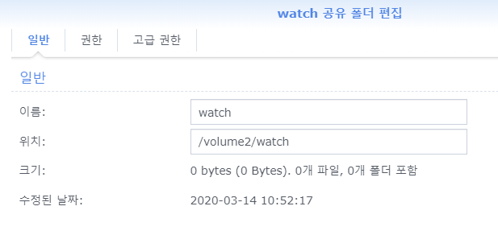
  - Telegram bot 소스 코드를 넣을 'system/tgbot-ds' 폴더를 생성합니다.
    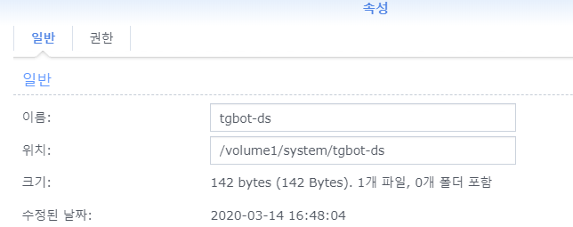
    
2. Synology API 연동용 계정 생성
  - 'tt_api'라는 계정을 만들고 watch 폴더의 읽고/쓰기 권한을 줍니다.
    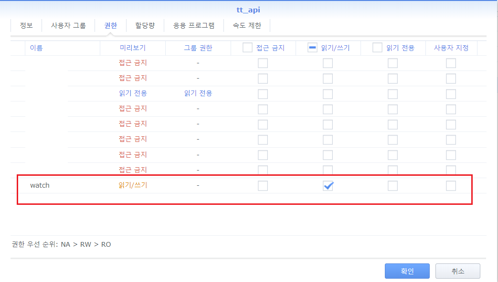
  - Synology API에서 연동할 수 있도록 Download Station 응용프로그램 허용 권한을 줍니다.
    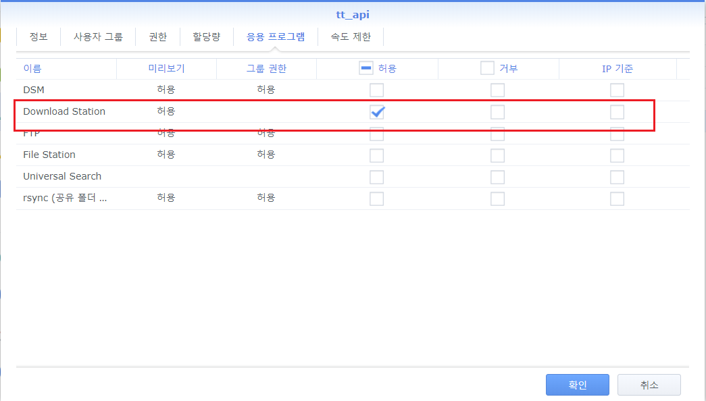
  - 계정을 생성했으면 현재계정을 로그 아웃하고, 생성한 계정으로 로그인을 해봅니다.
    
3. Download Station 감시 설정
  - Download Station 설정에서 Torrent 파일 감시할 수 있도록 합니다.
    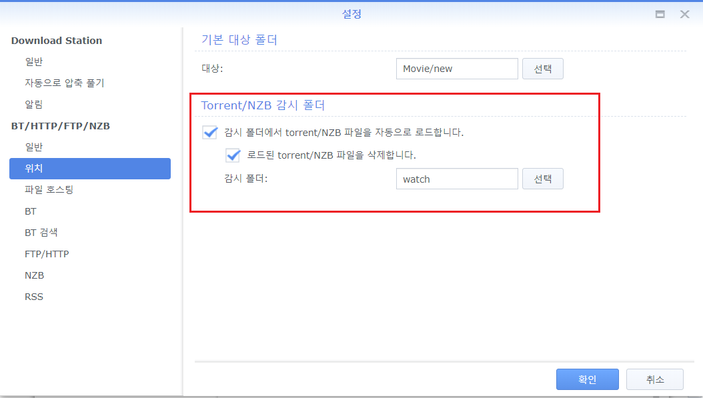

4. Synology API 설정
  - 제어판 > 응용 프로그램 포털에서 'Download Station'을 선택하고 [편집] 버튼을 눌러 사용자 지정 포트를 활성화합니다.
    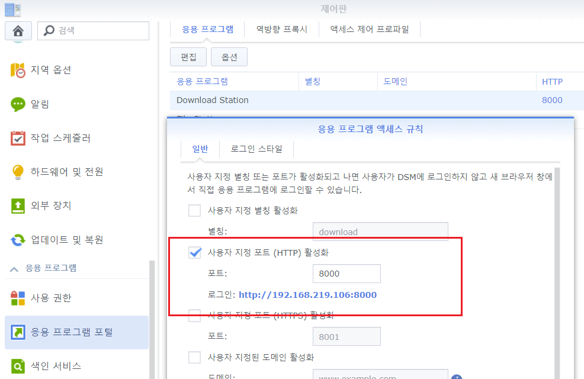
    
5. Docker 설정
  - Docker 설치가 안 되어 있으면, 패키지 센터에서 Docker를 먼저 설치합니다.
  - Docker를 열어서 '이미지' 메뉴 > [추가] 버튼 > URL에서 추가 > 'golang' 입력 > '1-alpine' 태그 선택을 합니다.
    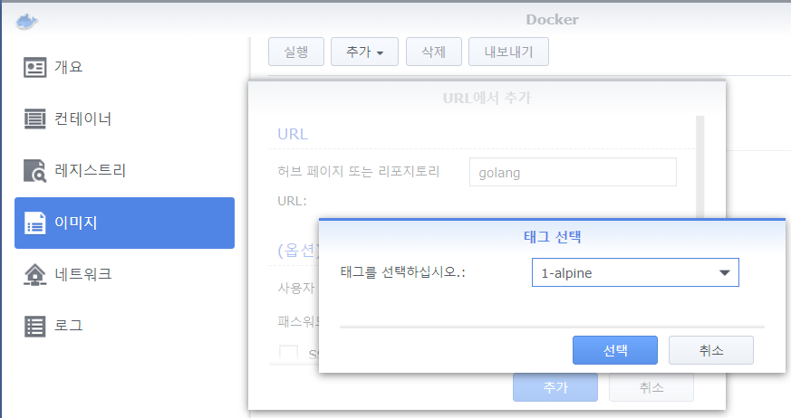
  - 잠시 후 이미지가 생성되면 이미지를 선택하고 [실행] 버튼을 누릅니다.
  - 컨테이너 생성 화면에서 [고급 설정] 버튼을 누릅니다.
    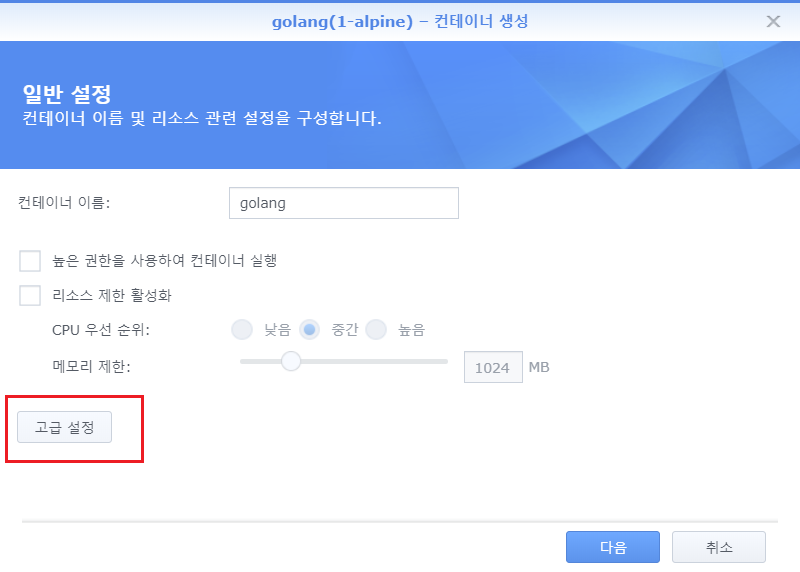
  - 고급 설정 창 > 고급 설정 > 자동 재시작 활성화를 누릅니다.
    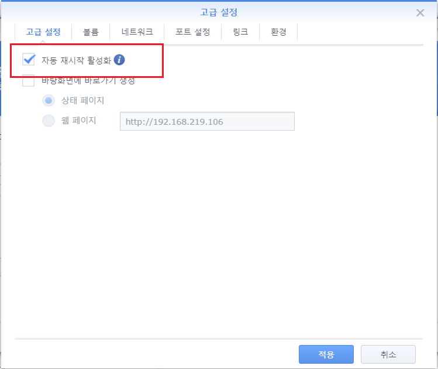
  - 컨테이너가 폴더 접근을 할 수있도록 볼륨을 설정합니다.
     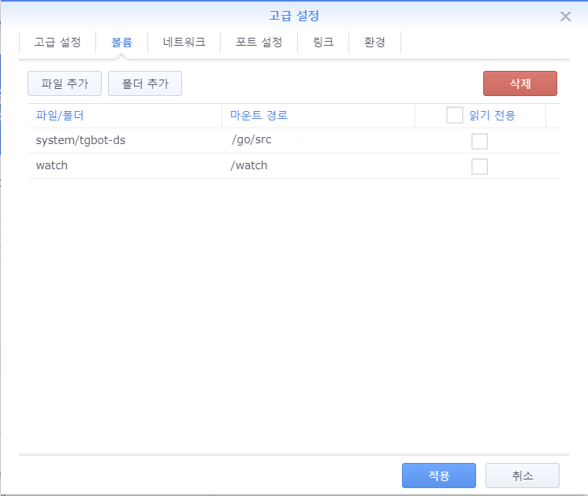
  - App에서 환경 변수를 추가합니다.
     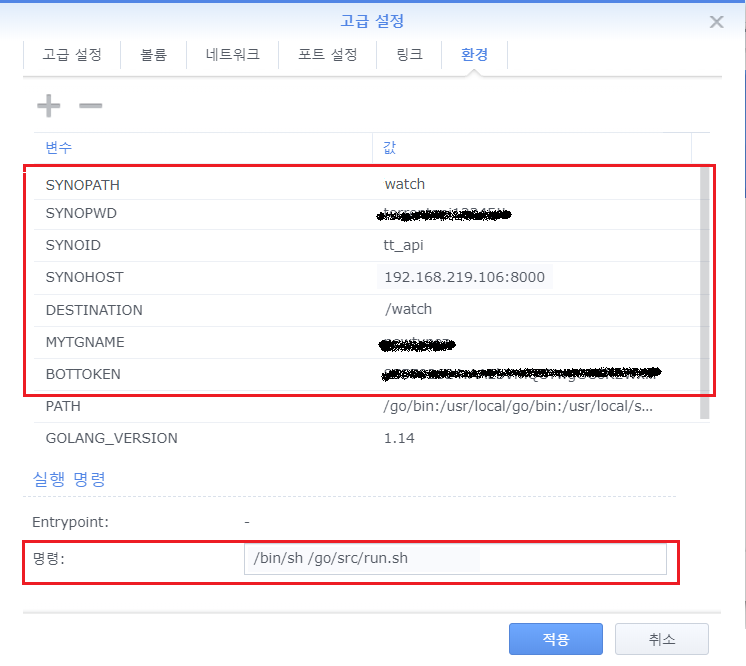
      - BOTTOKEN에는 봇을 생성할때 기록해둔 토큰값을 입력합니다.
      - MYTGNAME에는 봇과 대화할 내 텔레그램 이름입니다.
      - DESTINATION에는 Download Station에서 감시할 '/watch' 경로입니다.
      - SYNOHOST는 Synology API 설정에서 지정한 사용자 지정 URL과 포트입니다.
      - SYNID는 위에서 생성한 Synology API 연동 ID입니다.
      - SYNPWD는 위에서 생성한 Synology API 연동 ID의 암호입니다.
  - 명령에는 /bin/sh /go/src/run.sh 를 입력합니다.
  - 이렇게 하면 시놀에서 Golang을 실행할 수 있는 환경이 만들어집니다.

## 테스트
1. Docker > 컨테이너 메뉴에서 생성한 Golang을 실행해주고, [세부사항] 버튼을 눌러 창을 엽니다.
   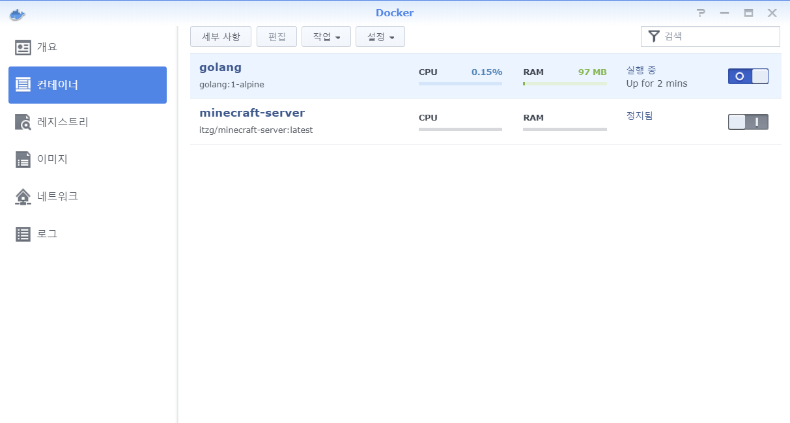
   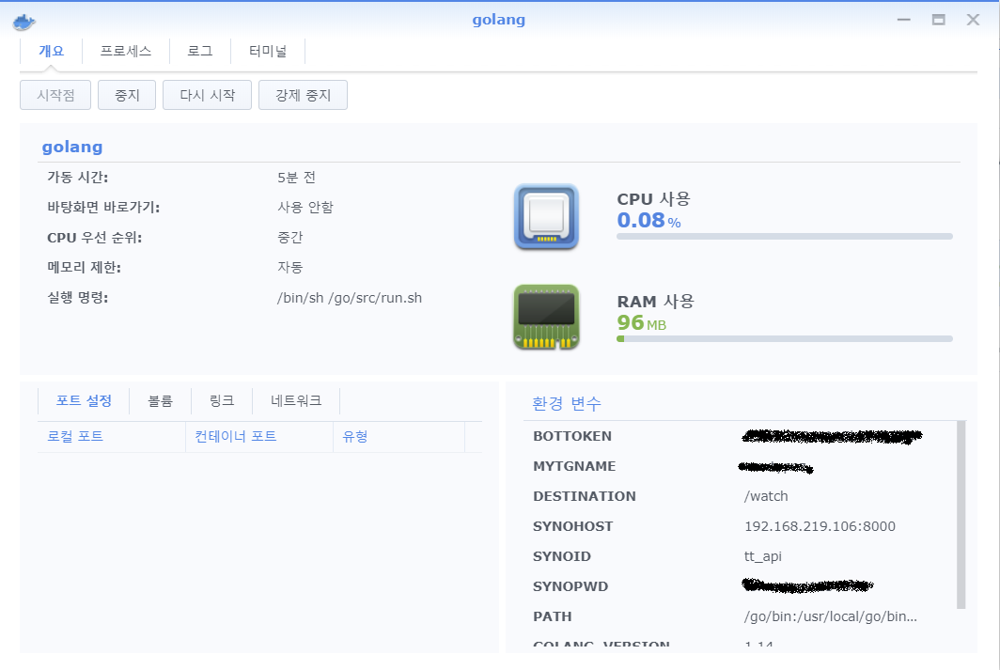
2. '로그'탭으로 이동해서 로그를 확인합니다. 아래와 같은 로그가 올라오면 준비가 된 것입니다.
   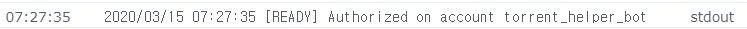
3. Telegram에서 봇 에게 Torrent 파일을 전송하거나, magent URI를 메시지로 보내면 Download Station에서 다운이 됩니다.
